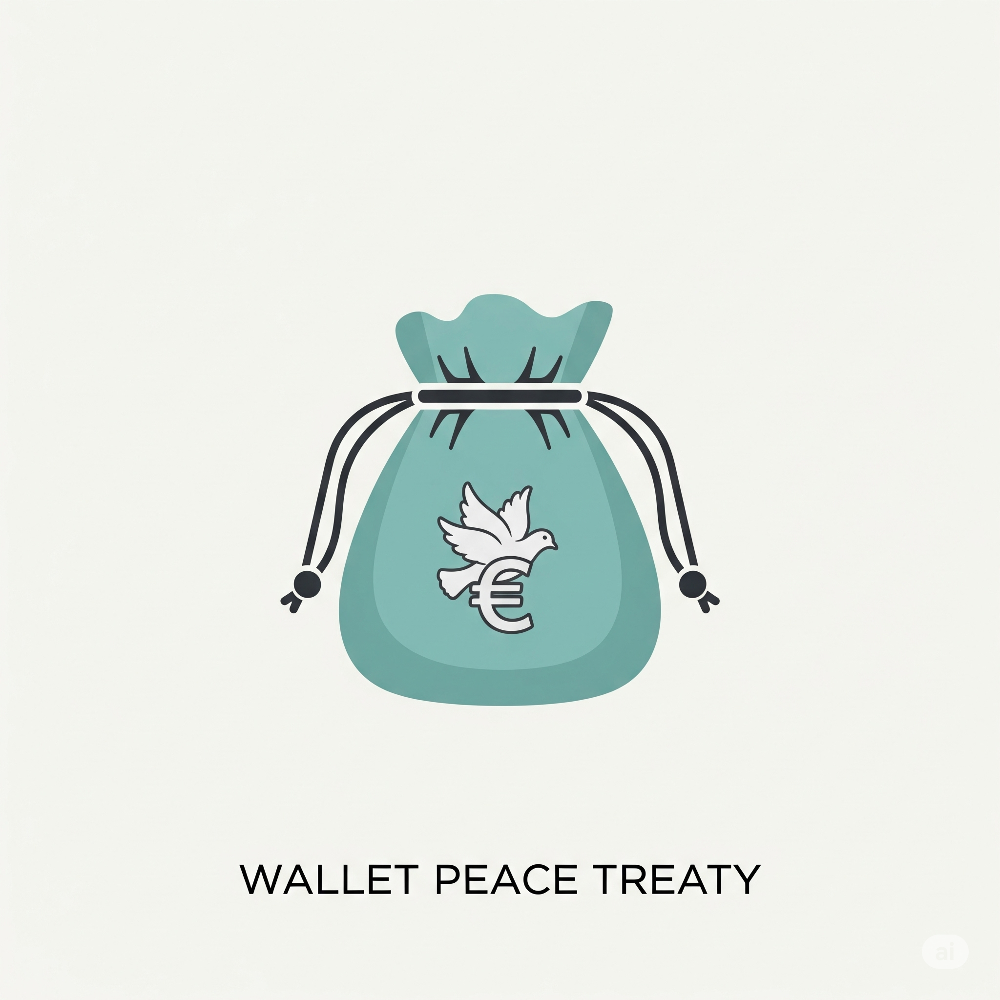

<div align="center">
	
</div>

</br>

<h1 align="center">お財布平和条約</h1>
<div align="center">

金銭トラブルを終わらせる、新・平和条約

楽しかった思い出を最後で壊さないために、みんなが納得できる割り勘をしよう。

</div>

## Tech Stacks

<p align="center">
  <a href="https://skillicons.dev">
    
		</br>
		
  </a>
</p>

## Create Environment
基本Dockerを用いてセットアップすることを前提としている。

### リポジトリをクローン
ローカルにリポジトリをクローンします。
```
$ git clone https://github.com/Team-Hayashi-Kari/wallet-peace-treaty.git
```

### Dockerをインストール
それぞれのOSに適した方法でDocker、Docker composeをダウンロード、インストールします

#### Mac(brew)
```
$ brew install --cask docker docker-compose
```

### ローカルサーバーを起動
以下のコマンドを用いることで開発用サーバーをセットアップ、起動させることができます(デタッチしたまま起動する場合)
```
$ docker compose up -d
```
以下のコマンドでDockerを終了できます。
```
$ docker compose down
```
以下のコマンドを用いることで、終了時にコンテナも同時に削除できます
```
$ docker compose down --rmi all
```